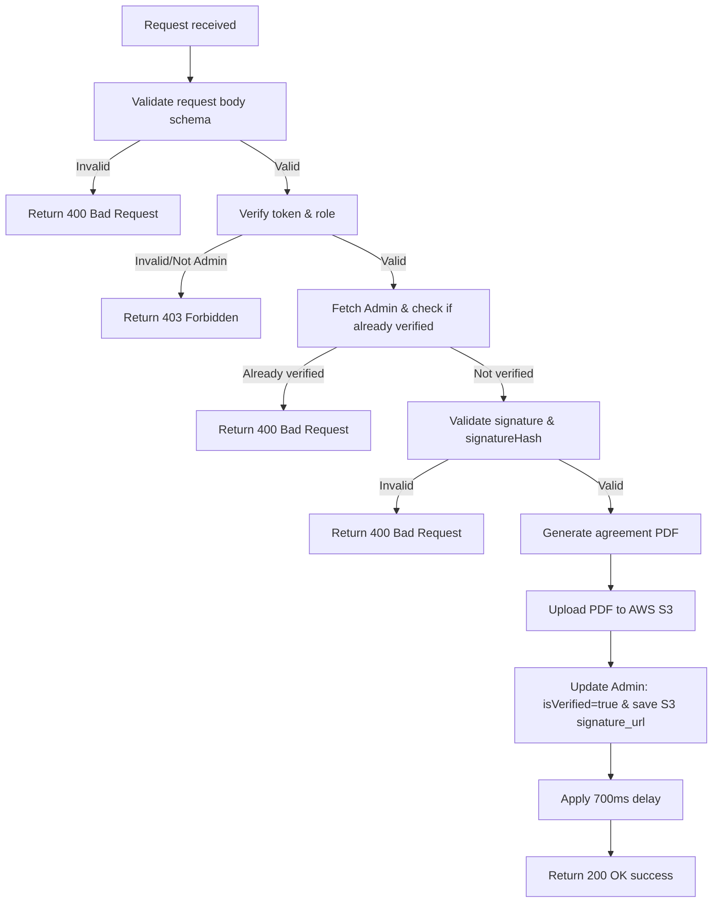

# Generate Admin Agreement

Verifies the admin's signature and generated hash, renders the PDF agreement, uploads it to S3, and verifies the administrator account.

---

## Endpoint

```http
POST /api/v3/admin/agreement
```

---

## Access

| Property       | Value        |
| -------------- | ------------ |
| Route Type     | Public       |
| Authentication | Not Required |
| Authorization  | Anyone with a valid verification token |

> **What does this mean?**
> A caller does not need a standard `Authorization` Bearer token to access this endpoint, but must send a valid verification token in the request body.

---

## Headers

| Header       | Required | Example            | Description         |
| ------------ | -------- | ------------------ | ------------------- |
| Content-Type | Yes      | `application/json` | Request body format |

---

# Request Body

Send the following JSON in the request body.

| Field         | Type    | Required | Description                                                         | Example                                         |
| ------------- | ------- | -------- | ------------------------------------------------------------------- | ----------------------------------------------- |
| signature     | string  | Yes      | Base64 PNG data URL of the handwritten signature image (max 1MB)   | `"data:image/png;base64,iVBORw0KGgoAAA..."`      |
| signatureHash | string  | Yes      | SHA-256 hash of the generated signature verified on the frontend    | `"d5a6a3b7... (64 hex characters)"`             |
| isAgreed      | boolean | Yes      | Must be `true` to indicate agreement to terms                       | `true`                                          |
| token         | string  | Yes      | The JWT verification token sent to the admin's email               | `eyJhbGciOi...`                                 |

> This endpoint uses **strict validation** — sending any field that is not in the table above will cause the request to fail.

---

# Behavior

This endpoint finalizes the admin email verification process. It completes verification by:
1. Validating the signature.
2. Generating a legal PDF document.
3. Storing it on S3.
4. Setting `isVerified = true` on the admin account.

---

# How It Works

1. The request body is validated against `agreementSchema`.
2. It verifies that `isAgreed` is `true`.
3. The verification token is decoded and validated; it checks that the role is `MODERATOR` or `ADMIN`.
4. The server fetches the admin record by the token's email.
5. It verifies the admin is not already verified and that the JTI matches `admin.hashedJti`.
6. The server generates its own cryptographic signature using the admin payload and verifies it against the provided `signatureHash` and `signature` to ensure authenticity.
7. The signer's IP address and current date are captured.
8. The signature image is compressed, and a legal agreement PDF is generated containing the admin details, date, IP address, and signature.
9. The PDF is uploaded to AWS S3 storage under the path `agreements/${agreementId}/agreement.pdf`.
10. The admin record is updated: `isVerified` is set to `true`, and `signature_url` is updated with the S3 key.
11. The 700ms enforced delay is applied.
12. A success response is returned.

## Flow Diagram



---

# Rate Limiting

| Property | Value                             |
| -------- | --------------------------------- |
| Enabled  | Yes                               |
| Delay    | 700 ms enforced delay per request |

---

# Validation Rules

| Field         | Rules                                                                                                     |
| ------------- | --------------------------------------------------------------------------------------------------------- |
| signature     | Required. Must be a valid Base64 PNG image string starting with `data:image/png;base64,`. Max size: 1MB.  |
| signatureHash | Required. Must be a 64-character hexadecimal SHA-256 hash.                                               |
| isAgreed      | Required. Must be literally `true`.                                                                      |
| token         | Required. Must be a valid JWT verification token.                                                         |

---

# Errors

| Status | Cause |
| ------ | ----- |
| 400    | Request body failed schema validation, `isAgreed` is not true, admin not found, email already verified, invalid signature/hash, or verification token has expired or is invalid. |
| 403    | The verification token's role claim is not `MODERATOR` or `ADMIN`. |
| 500    | Failed to generate PDF, upload to S3, or update admin status in the database. |

---

# Response Fields

| Field   | Type    | Description                             |
| ------- | ------- | --------------------------------------- |
| success | boolean | Indicates whether the request succeeded |
| message | string  | Human-readable response message         |

---

# Notes

- The request body is strict — do not send extra fields.
- Processing this endpoint involves PDF compilation and S3 file uploads, so it might have higher latency which is compounded by the 700ms rate-limiting delay.

---

# Version History

| Date       | Author   | Description                             |
| ---------- | -------- | --------------------------------------- |
| 2026-06-19 | rushiii3 | Initial documentation for this endpoint |

---

# Quick Summary

| Item            | Value                            |
| --------------- | -------------------------------- |
| Endpoint        | `/api/v3/admin/agreement`        |
| Method          | `POST`                           |
| Route Type      | Public                           |
| Authentication  | Not Required                     |
| Content-Type    | `application/json`               |
| Success Status  | `200 OK`                         |
| Rate Limit      | 700ms enforced delay per request |
| Response Format | JSON                             |
