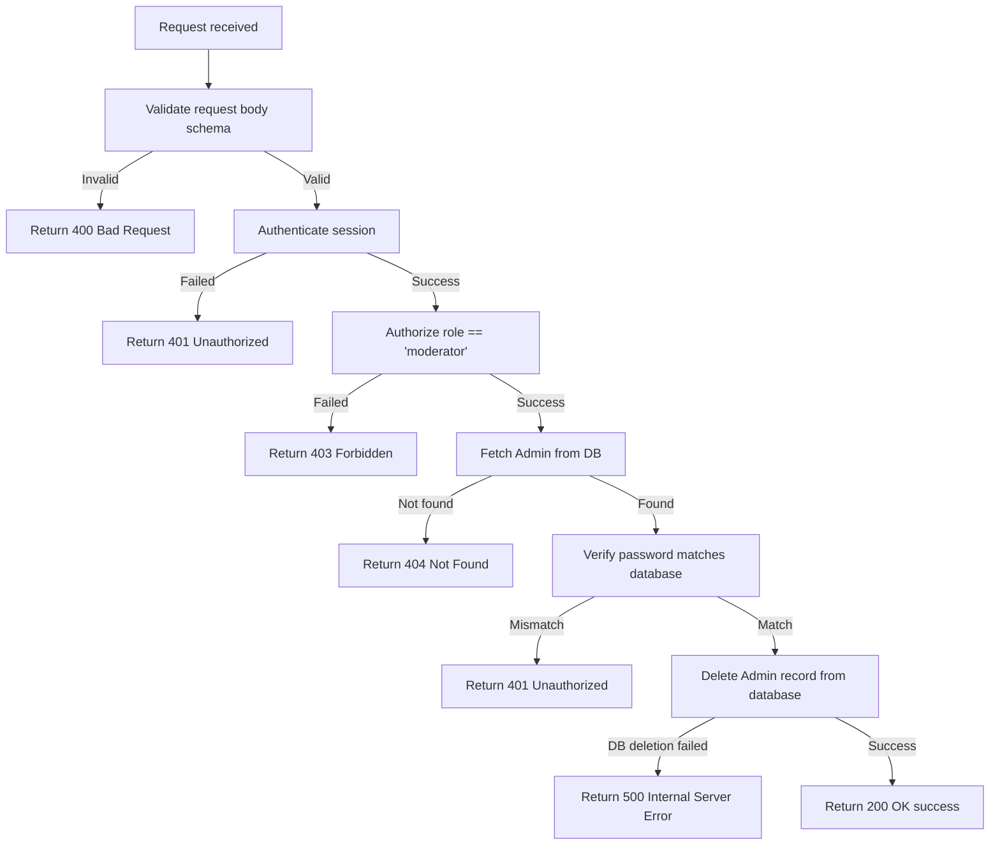

# Delete Admin Account

Deletes the authenticated administrator's account from the database.

---

## Endpoint

```http
DELETE /api/v3/admin/delete
```

---

## Access

| Property       | Value        |
| -------------- | ------------ |
| Route Type     | Private      |
| Authentication | Required     |
| Authorization  | Moderator only |

> **What does this mean?**
> A logged-in administrator/moderator can delete their own account by verifying their password.

---

## Headers

| Header        | Required | Example            | Description                   |
| ------------- | -------- | ------------------ | ----------------------------- |
| Authorization | Yes      | `Bearer <token>`   | Admin's session/refresh token |
| Content-Type  | Yes      | `application/json` | Request body format           |

---

# Request Body

Send the following JSON in the request body.

| Field    | Type   | Required | Description                                    | Example       |
| -------- | ------ | -------- | ---------------------------------------------- | ------------- |
| password | string | Yes      | Account password required for verification   | `"AdminPass@123"` |

> This endpoint uses **strict validation** — sending any field that is not in the table above will cause the request to fail.

---

# Behavior

1. The deletion requires password confirmation. If the password is incorrect, the account is not deleted and a `401 Unauthorized` error is returned.
2. Once verified, the account is permanently removed from the database.

---

# How It Works

1. The request body is validated against `adminDeleteProfile` schema (strict).
2. The user session is authenticated and authorized via the middleware.
3. The server finds the admin record by `userId` (from `req.user.userId`).
4. If the admin is not found, a `404 Not Found` error is returned.
5. The server checks that the provided `password` matches the stored hash in the database.
6. If the password check fails, it throws `401 Unauthorized` (`Invalid old password`).
7. The account is deleted from the database.
8. If the database deletion fails, it throws a `500 Internal Server Error`.
9. Returns `200 OK` success response.

## Flow Diagram



---

# Validation Rules

| Field    | Rules |
| -------- | ----- |
| password | Required. Must match strength requirements (8–100 characters, at least 1 uppercase, 1 lowercase, 1 number, and 1 special character). |

---

# Errors

| Status | Cause |
| ------ | ----- |
| 400    | Request body failed schema validation (missing password field or malformed characters). |
| 401    | Missing, invalid, or expired session token, or the password verification failed. |
| 403    | The authenticated user does not have the `moderator` role. |
| 404    | Admin account not found in the database. |
| 500    | Unexpected server error or database deletion failure. |

---

# Response Fields

| Field   | Type    | Description                             |
| ------- | ------- | --------------------------------------- |
| success | boolean | Indicates whether the request succeeded |
| message | string  | Human-readable response message         |

---

# Version History

| Date       | Author   | Description                             |
| ---------- | -------- | --------------------------------------- |
| 2026-06-19 | rushiii3 | Initial documentation for this endpoint |

---

# Quick Summary

| Item            | Value                       |
| --------------- | --------------------------- |
| Endpoint        | `/api/v3/admin/delete`      |
| Method          | `DELETE`                    |
| Route Type      | Private                     |
| Authentication  | Required                    |
| Content-Type    | `application/json`          |
| Success Status  | `200 OK`                    |
| Rate Limit      | N/A                         |
| Response Format | JSON                        |
