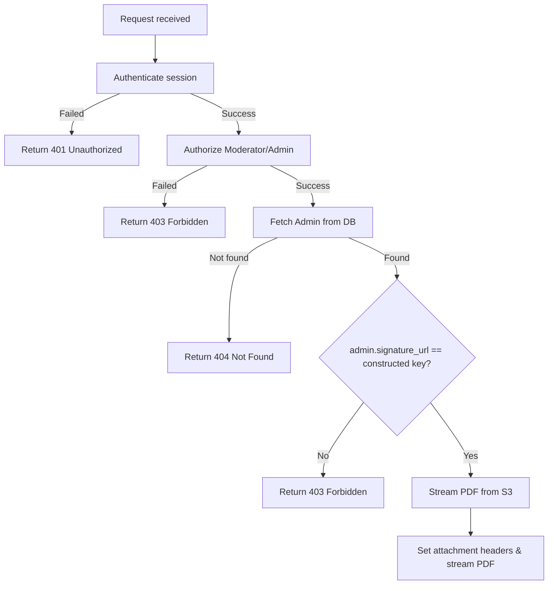

# Get Agreement PDF

Downloads the signed agreement PDF for the authenticated administrator.

---

## Endpoint

```http
GET /api/v3/admin/agreements/:id/agreement.pdf
```

---

## Access

| Property       | Value        |
| -------------- | ------------ |
| Route Type     | Private      |
| Authentication | Required     |
| Authorization  | Admin/Moderator owning the agreement |

> **What does this mean?**
> Callers must be logged in. The endpoint verifies that the authenticated user is the owner of the requested agreement. You cannot download other admins' agreements.

---

## Headers

| Header        | Required | Example          | Description                   |
| ------------- | -------- | ---------------- | ----------------------------- |
| Authorization | Yes      | `Bearer <token>` | Admin's session/refresh token |

> Alternatively, the endpoint can authenticate via a `refreshToken` cookie if sent by the browser.

---

# Path Parameters

| Parameter | Type   | Required | Description                                     | Example |
| --------- | ------ | -------- | ----------------------------------------------- | ------- |
| id        | string | Yes      | The unique identifier of the generated agreement | `5f8d0a9b...` |

---

# Behavior

This endpoint streams the requested PDF directly from the S3 storage bucket. It enforces strict ownership checks, meaning a `403 Forbidden` error is returned if a moderator tries to download a PDF that does not match their own `signature_url`.

---

# How It Works

1. The request is authenticated and authorized via the middleware.
2. The endpoint extracts the `:id` parameter and the authenticated `userId`.
3. The server constructs the S3 storage key: `agreements/${id}/agreement.pdf`.
4. The server fetches the admin record from the database.
5. If the admin is not found, a `404 Not Found` is returned.
6. The server checks if the admin's `signature_url` matches the constructed key. If they do not match, it returns a `403 Forbidden` error.
7. The server requests a read stream for the S3 key.
8. It sets response headers:
   - `Content-Type: application/pdf`
   - `Content-Disposition: attachment; filename=agreement-${id}.pdf`
9. The PDF file content is streamed back to the client.

## Flow Diagram



---

# Errors

| Status | Cause |
| ------ | ----- |
| 401    | Missing, invalid, or expired session token. |
| 403    | The authenticated user does not have access to this agreement PDF, or does not have the required role. |
| 404    | Admin not found in the database. |
| 500    | Error streaming the PDF from S3 storage. |

---

# Response Format

This endpoint does not return JSON on success. It returns a binary data stream with the following headers:

- `Content-Type: application/pdf`
- `Content-Disposition: attachment; filename=agreement-<id>.pdf`

---

# Version History

| Date       | Author   | Description                             |
| ---------- | -------- | --------------------------------------- |
| 2026-06-19 | rushiii3 | Initial documentation for this endpoint |

---

# Quick Summary

| Item            | Value                                         |
| --------------- | --------------------------------------------- |
| Endpoint        | `/api/v3/admin/agreements/:id/agreement.pdf`  |
| Method          | `GET`                                         |
| Route Type      | Private                                       |
| Authentication  | Required                                      |
| Content-Type    | `application/pdf` (Binary Stream)             |
| Success Status  | `200 OK`                                      |
| Rate Limit      | N/A                                           |
| Response Format | PDF Binary File                               |
