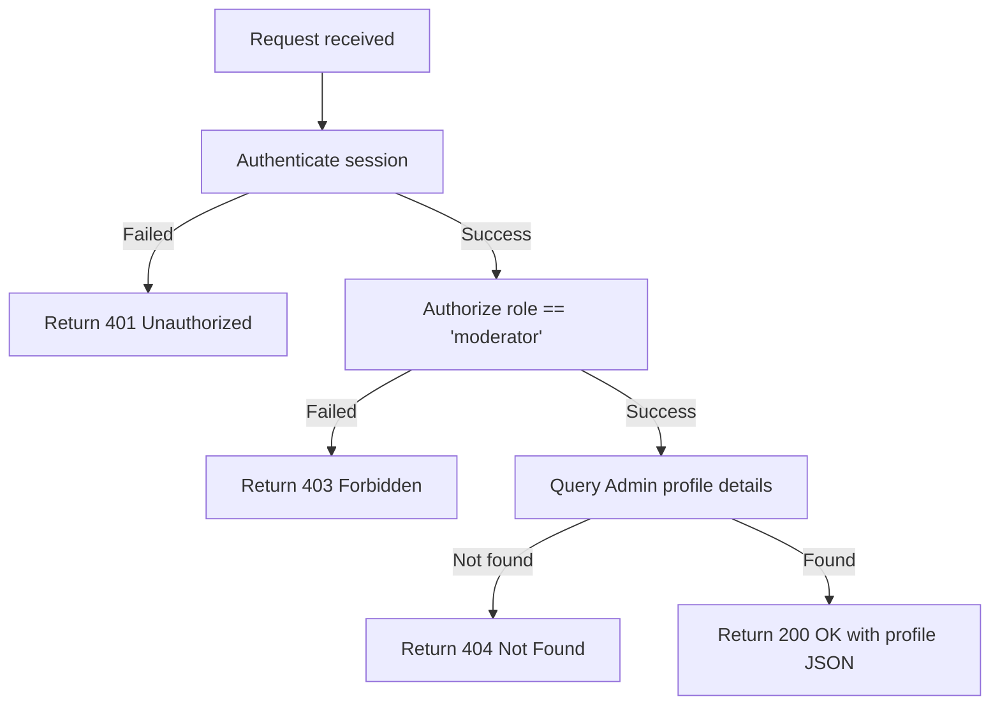

# Get Admin Profile

Fetches the profile details of the authenticated administrator/moderator.

---

## Endpoint

```http
GET /api/v3/admin/getprofile
```

---

## Access

| Property       | Value        |
| -------------- | ------------ |
| Route Type     | Private      |
| Authentication | Required     |
| Authorization  | Moderator only |

> **What does this mean?**
> A caller must be logged in as an administrator/moderator with a valid session token to retrieve their profile details.

---

## Headers

| Header        | Required | Example          | Description                   |
| ------------- | -------- | ---------------- | ----------------------------- |
| Authorization | Yes      | `Bearer <token>` | Admin's session/refresh token |

---

# Request Body

This endpoint does not accept a request body.

---

# Behavior

This endpoint retrieves a sanitized subset of fields from the database representing the logged-in administrator's profile. Sensitive fields such as `password`, `refreshToken`, `fcmToken`, and OTP details are omitted.

---

# How It Works

1. The request is authenticated and authorized via the middleware.
2. The endpoint extracts the `userId` from `req.user.userId`.
3. The server queries the database for the admin record matching this ID, selecting only: `_id`, `role`, `Profile_avtar`, `user_name`, `user_handle`, and `email`.
4. If the admin record is not found, a `404 Not Found` error is returned.
5. On success, returns `200 OK` with the profile data.

## Flow Diagram



---

# Errors

| Status | Cause |
| ------ | ----- |
| 401    | Missing, invalid, or expired session token. |
| 403    | The authenticated user does not have the `moderator` role. |
| 404    | Admin account not found in the database. |
| 500    | Unexpected server error. |

---

# Response Fields

| Field                | Type    | Description                                             |
| -------------------- | ------- | ------------------------------------------------------- |
| success              | boolean | Indicates whether the request succeeded                 |
| message              | string  | Human-readable response message                         |
| data.admin._id       | string  | Database unique identifier                              |
| data.admin.role      | string  | Role assigned to the user (e.g. `moderator`)            |
| data.admin.Profile_avtar | string | URL of the profile avatar image                      |
| data.admin.user_name | string  | Display name of the admin                               |
| data.admin.user_handle| string | Unique username handle                                 |
| data.admin.email     | string  | Registered email address                                |

---

# Version History

| Date       | Author   | Description                             |
| ---------- | -------- | --------------------------------------- |
| 2026-06-19 | rushiii3 | Initial documentation for this endpoint |

---

# Quick Summary

| Item            | Value                       |
| --------------- | --------------------------- |
| Endpoint        | `/api/v3/admin/getprofile`  |
| Method          | `GET`                       |
| Route Type      | Private                     |
| Authentication  | Required                    |
| Content-Type    | N/A                         |
| Success Status  | `200 OK`                    |
| Rate Limit      | N/A                         |
| Response Format | JSON                        |
