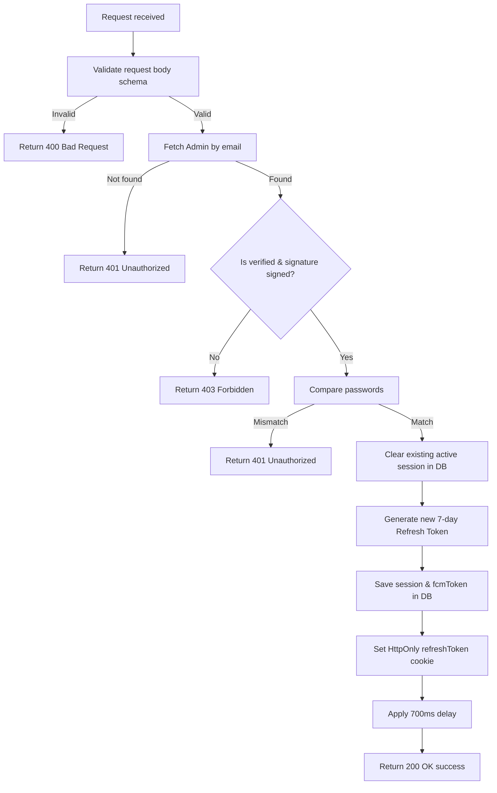

# Admin Login

Authenticates an administrator/moderator and returns a session refresh token and cookie.

---

## Endpoint

```http
POST /api/v3/admin/login
```

---

## Access

| Property       | Value        |
| -------------- | ------------ |
| Route Type     | Public       |
| Authentication | Not Required |
| Authorization  | Anyone       |

> **What does this mean?**
> This is a public endpoint used to authenticate administrators. Anyone can send credentials to it.

---

## Headers

| Header       | Required | Example            | Description         |
| ------------ | -------- | ------------------ | ------------------- |
| Content-Type | Yes      | `application/json` | Request body format |

---

# Request Body

Send the following JSON in the request body.

| Field    | Type   | Required | Description                                                    | Example |
| -------- | ------ | -------- | -------------------------------------------------------------- | ------- |
| email    | string | Yes      | Administrator's email address                                  | `"admin@example.com"` |
| password | string | Yes      | Account password                                               | `"Test@123"` |
| fcmToken | string | Yes      | Firebase Cloud Messaging (FCM) push token (100–4096 characters)| `"fcm_token_string_here..."` |

> This endpoint uses **strict validation** — sending any field that is not in the table above will cause the request to fail.

---

# Behavior

When a user logs in:
1. The server checks that the admin has been verified (`isVerified === true`) and has signed the agreement (`signature_url !== ''`).
2. Any existing active sessions for this administrator are terminated to prevent session reuse/hijacking.
3. A cookie named `refreshToken` is set in the HTTP response.
4. The endpoint enforces a minimum processing duration of 700ms to mitigate brute-force and timing attacks.

---

# How It Works

1. The request body is validated against `loginSchema`.
2. The server searches for the admin using the provided `email`.
3. If the admin is not found, a `401 Unauthorized` error is returned.
4. The server checks if the admin is verified and has a valid `signature_url`. If not, a `403 Forbidden` error is returned.
5. The server compares the provided password with the hashed password in the database.
6. If the passwords do not match, a `401 Unauthorized` error is returned.
7. Any existing refresh token session is removed from the database for this admin.
8. A new JWT refresh token is generated (valid for 7 days).
9. The session details (token identifier `jti` and `fcmToken`) are saved in the database.
10. The `refreshToken` cookie is set in the response headers.
11. The 700ms delay is applied.
12. The success response is returned with the admin details and token.

## Flow Diagram



---

# Rate Limiting

| Property | Value                             |
| -------- | --------------------------------- |
| Enabled  | Yes                               |
| Delay    | 700 ms enforced delay per request |

---

# Validation Rules

| Field    | Rules |
| -------- | ----- |
| email    | Required. Must be a valid email. Max 254 characters. Automatically converted to lowercase. |
| password | Required. 8–100 characters. Must include at least 1 uppercase letter, 1 lowercase letter, 1 number, and 1 special character. |
| fcmToken | Required. 100–4096 characters. Only letters, numbers, hyphens, underscores, and colons are allowed (`^[A-Za-z0-9\-_:]+$`). |

---

# Errors

| Status | Cause |
| ------ | ----- |
| 400    | Request body failed schema validation (missing fields, invalid format, weak password, or FCM token issues). |
| 401    | Invalid email or password. |
| 403    | Account not verified or agreement not signed yet. |
| 500    | Unexpected server error. |

---

# Response Fields

| Field              | Type    | Description                                             |
| ------------------ | ------- | ------------------------------------------------------- |
| success            | boolean | Indicates whether the authentication succeeded          |
| message            | string  | Human-readable response message                         |
| data.admin.email   | string  | The administrator's email address                      |
| data.admin.user_name| string  | The display name of the administrator                   |
| data.admin.role    | string  | The role assigned to the admin (e.g. `MODERATOR`)       |
| data.admin.isVerified| boolean | Verification status                                    |
| data.admin.user_handle| string | Unique username handle                                 |
| data.refreshToken  | string  | The generated JWT session token                         |

---

# Cookies Set

| Cookie Name  | Value               | HttpOnly | Secure                       | SameSite | Max Age  |
| ------------ | ------------------- | -------- | ---------------------------- | -------- | -------- |
| refreshToken | JWT token string    | Yes      | Yes (in production environment) | Strict   | 7 days   |

---

# Version History

| Date       | Author   | Description                             |
| ---------- | -------- | --------------------------------------- |
| 2026-06-19 | rushiii3 | Initial documentation for this endpoint |

---

# Quick Summary

| Item            | Value                            |
| --------------- | -------------------------------- |
| Endpoint        | `/api/v3/admin/login`            |
| Method          | `POST`                           |
| Route Type      | Public                           |
| Authentication  | Not Required                     |
| Content-Type    | `application/json`               |
| Success Status  | `200 OK`                         |
| Rate Limit      | 700ms enforced delay per request |
| Response Format | JSON                             |
