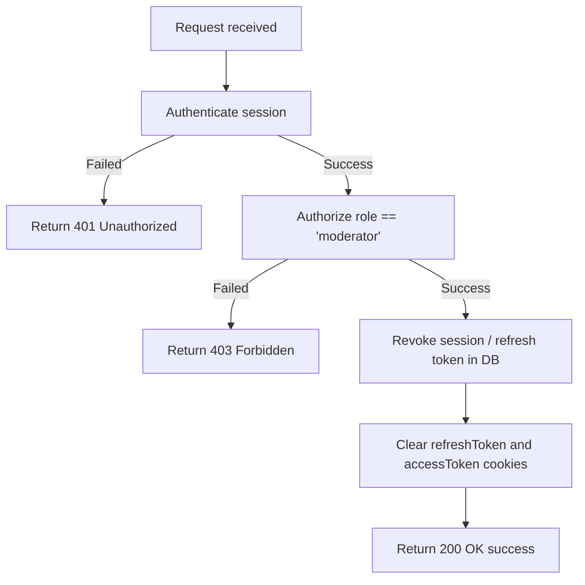

# Admin Logout

Logs out the authenticated administrator/moderator, invalidates their session in the database, and clears the response cookies.

---

## Endpoint

```http
POST /api/v3/admin/logout
```

---

## Access

| Property       | Value        |
| -------------- | ------------ |
| Route Type     | Private      |
| Authentication | Required     |
| Authorization  | Moderator only |

> **What does this mean?**
> Only authenticated users with the `moderator` role can access this endpoint. It requires a valid session token (via cookie or Bearer header) to log out.

---

## Headers

| Header        | Required | Example          | Description                   |
| ------------- | -------- | ---------------- | ----------------------------- |
| Authorization | Yes      | `Bearer <token>` | Admin's session/refresh token |

> Alternatively, the session can be authenticated via the `refreshToken` cookie if sent by the browser.

---

# Request Body

This endpoint does not accept a request body.

---

# Behavior

When called:
1. The administrator's active refresh token in the database is deleted/revoked (using `logoutAdmin`).
2. The client cookies `refreshToken` and `accessToken` are cleared by setting their values to empty and expiration to the past.
3. A success response is returned.

---

# How It Works

1. The request is authenticated and authorized via the middleware.
2. The endpoint extracts the `userId` from `req.user`.
3. The server updates the admin's record in the database, clearing the stored refresh token and session info.
4. Response cookies `refreshToken` and `accessToken` are cleared with `httpOnly: true`, `secure: true` (in production), and `sameSite: 'strict'`.
5. Returns `200 OK` success response.

## Flow Diagram



---

# Errors

| Status | Cause |
| ------ | ----- |
| 401    | Missing, invalid, or expired session token. |
| 403    | The authenticated user does not have the `moderator` role. |
| 500    | Unexpected server error during session deletion. |

---

# Response Fields

| Field   | Type    | Description                             |
| ------- | ------- | --------------------------------------- |
| success | boolean | Indicates whether the request succeeded |
| message | string  | Human-readable response message         |

---

# Notes

- Both `refreshToken` and `accessToken` cookies are cleared on the response, regardless of which token was used to authenticate.

---

# Version History

| Date       | Author   | Description                             |
| ---------- | -------- | --------------------------------------- |
| 2026-06-19 | rushiii3 | Initial documentation for this endpoint |

---

# Quick Summary

| Item            | Value                     |
| --------------- | ------------------------- |
| Endpoint        | `/api/v3/admin/logout`    |
| Method          | `POST`                    |
| Route Type      | Private                   |
| Authentication  | Required                  |
| Content-Type    | N/A                       |
| Success Status  | `200 OK`                  |
| Rate Limit      | N/A                       |
| Response Format | JSON                      |
