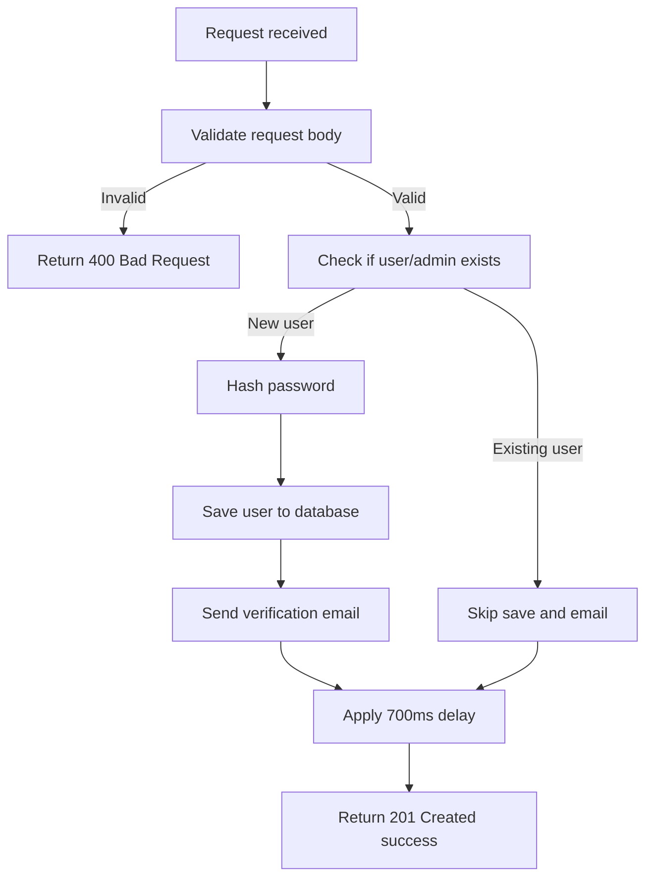

# Register Admin

Creates a new admin account in the system.

---

## Endpoint

```http
POST /api/v3/admin/register
```

---

## Access

| Property       | Value        |
| -------------- | ------------ |
| Route Type     | Public       |
| Authentication | Not Required |
| Authorization  | Anyone       |

> **What does this mean?**
> Anyone can call this endpoint without logging in or sending an access token. It's used to create a new admin account, so it's open by design.

> **Note:** Bruno may show `auth: inherit` on this request because of collection-level settings, but the server does **not** actually check for any token here. You can safely ignore it or set it to "No Auth" in Bruno.

---

## Headers

| Header       | Required | Example            | Description         |
| ------------ | -------- | ------------------ | ------------------- |
| Content-Type | Yes      | `application/json` | Request body format |

No `Authorization` header is needed for this endpoint.

---

# Request Body

Send the following JSON in the request body.

| Field         | Type   | Required | Description               | Example                            |
| ------------- | ------ | -------- | ------------------------- | ---------------------------------- |
| user_name     | string | Yes      | Display name of the admin | `"test"`                           |
| user_handle   | string | Yes      | Unique username/handle    | `"test2"`                          |
| email         | string | Yes      | Admin's email address     | `"test2@gmail.com"`                |
| password      | string | Yes      | Account password          | `"Test@123"`                       |
| Profile_avtar | string | No       | Profile picture URL       | `"https://example.com/avatar.png"` |

> This endpoint uses **strict validation** — sending any field that is not in the table above (a typo, an extra field, etc.) will cause the whole request to fail.

---

# Behavior

This endpoint always returns the **same success response** (`201 Created`), whether the email/handle is new or already exists. This is intentional, to prevent attackers from using this endpoint to figure out which emails/handles are already registered (user enumeration).

| Case                        | Response    | Side Effect                |
| --------------------------- | ----------- | -------------------------- |
| Email/handle is new         | 201 Created | Verification email is sent |
| Email/handle already exists | 201 Created | No email is sent           |

> Because of this, **do not** treat the 201 response as proof that an account was actually created. If a contributor is testing this endpoint and the verification email never arrives, check whether the account already existed before assuming the endpoint is broken.

---

# How It Works

1. The request body is validated against the schema (`adminRegisterSchema`).
2. The server checks whether a user with the given email or handle already exists in the `User` or `UnverifiedUser` collections.
3. The password is hashed.
4. **If the user is new:** the record is saved to the database, and a verification email is sent (in production environment).
5. **If the user already exists:** the database save and verification email steps are skipped entirely.
6. The 700ms enforced delay is applied.
7. The same success response (`201 Created`) is sent, regardless of which branch was taken.

## Flow Diagram



> Note: steps 4 and 5 produce the exact same response on purpose — see **Behavior** above for why.

---

# Rate Limiting

| Property | Value                             |
| -------- | --------------------------------- |
| Enabled  | Yes                               |
| Delay    | 700 ms enforced delay per request |

Each request to this endpoint is deliberately delayed by 700ms before responding. This is a defensive measure, not a bug — don't "optimize" this away, and don't be surprised by the latency when testing.

---

# Validation Rules

| Field         | Rules                                                                                                                        |
| ------------- | ---------------------------------------------------------------------------------------------------------------------------- |
| user_name     | Required. 2–50 characters. Letters and spaces only.                                                                          |
| user_handle   | Required. 3–20 characters. Letters, numbers, and underscores only.                                                           |
| email         | Required. Must be a valid email. Max 254 characters. Automatically converted to lowercase.                                   |
| password      | Required. 8–100 characters. Must include at least 1 uppercase letter, 1 lowercase letter, 1 number, and 1 special character. |
| Profile_avtar | Optional. Must be a valid URL if provided.                                                                                   |

---

# Errors

| Status | Cause                                                                                             |
| ------ | ------------------------------------------------------------------------------------------------- |
| 400    | Request body failed validation (missing field, weak password, invalid email, unknown field, etc.) |
| 500    | Unexpected server error                                                                           |

> Note: there is no `409 Conflict` for a duplicate email/handle. See **Behavior** above — duplicate accounts still get a `201` response, by design.

---

# Response Fields

| Field   | Type    | Description                             |
| ------- | ------- | --------------------------------------- |
| success | boolean | Indicates whether the request succeeded |
| message | string  | Human-readable response message         |

---

# Notes

- Request body must be valid JSON.
- The `Content-Type` header must be `application/json`.
- This is a **public** endpoint — no `Authorization` header is needed.
- The request body is strict — do not send extra fields beyond what's listed in the table above.
- Always returns `201` on a well-formed request, even if the account already exists. Check your inbox for the verification email to confirm whether a new account was actually created.
- Every request is delayed by 700ms (rate limiting). This is expected, not a performance issue.
- See the **Behavior** and **Rate Limiting** sections above before assuming this endpoint is broken during testing.

---

# Version History

| Date       | Author   | Description                              |
| ---------- | -------- | ---------------------------------------- |
| 2026-06-19 | rushiii3 | Initial documentation for this endpoint. |

---

# Quick Summary

| Item            | Value                                |
| --------------- | ------------------------------------ |
| Endpoint        | `/api/v3/admin/register`             |
| Method          | `POST`                               |
| Route Type      | Public                               |
| Authentication  | Not Required                         |
| Content-Type    | `application/json`                   |
| Success Status  | `201 Created` (always, see Behavior) |
| Rate Limit      | 700ms enforced delay per request     |
| Response Format | JSON                                 |
