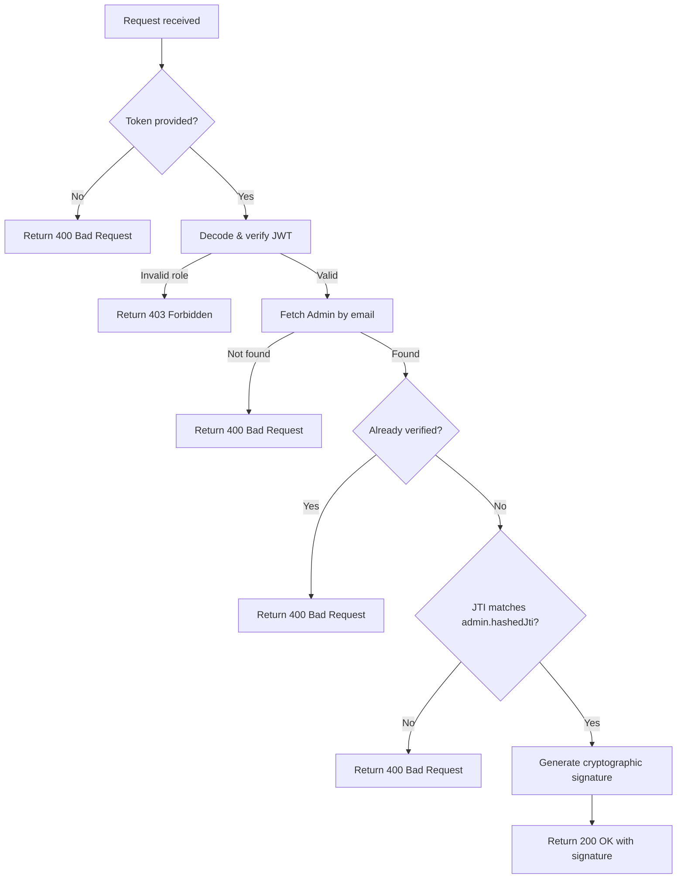

# Generate Admin Signature

Generates a cryptographic signature required for accepting the admin agreement.

---

## Endpoint

```http
GET /api/v3/admin/signature
```

---

## Access

| Property       | Value        |
| -------------- | ------------ |
| Route Type     | Public       |
| Authentication | Not Required |
| Authorization  | Anyone with a valid verification token |

> **What does this mean?**
> A caller does not need a standard `Authorization` Bearer token to access this endpoint, but they must provide a valid signup/verification token as a query parameter.

---

## Headers

This endpoint does not require any custom headers.

---

# Query Parameters

| Parameter | Type   | Required | Description                                                    | Example |
| --------- | ------ | -------- | -------------------------------------------------------------- | ------- |
| token     | string | Yes      | The JWT verification token sent to the admin's email on signup | `eyJhbGciOi...` |

---

# Behavior

This endpoint decodes the verification token, verifies the admin exists and is not already verified, and generates a short-lived signature payload. This signature is required by the frontend to sign the agreement and call the `/api/v3/admin/agreement` endpoint.

---

# How It Works

1. The query parameter `token` is retrieved and validated.
2. The verification token is decoded and validated using the server's security service.
3. The server checks that the token role is either `MODERATOR` or `ADMIN`.
4. The server searches for the admin account in the database using the email from the token.
5. It verifies that the email is not already verified.
6. It compares the token's JTI against the hashed JTI stored on the admin's record to ensure the token has not expired or been invalidated.
7. A cryptographic signature is generated using a payload containing the admin's ID, email, and role.
8. The server responds with the admin's display name and the generated signature.

## Flow Diagram



---

# Validation Rules

| Parameter | Rules |
| --------- | ----- |
| token     | Required. Must be a valid non-empty JWT verification token containing `email`, `role`, and `jti` claims. |

---

# Errors

| Status | Cause |
| ------ | ----- |
| 400    | Missing verification token, email is already verified, admin not found, or the token/JTI is expired or invalid. |
| 403    | The verification token's role claim is not `MODERATOR` or `ADMIN`. |
| 500    | Unexpected server error. |

---

# Response Fields

| Field            | Type    | Description                                             |
| ---------------- | ------- | ------------------------------------------------------- |
| success          | boolean | Indicates whether the signature was successfully generated |
| message          | string  | Human-readable response message                         |
| data.name        | string  | The display name of the admin user                      |
| data.signature   | string  | The generated cryptographic signature string            |

---

# Version History

| Date       | Author   | Description                             |
| ---------- | -------- | --------------------------------------- |
| 2026-06-19 | rushiii3 | Initial documentation for this endpoint |

---

# Quick Summary

| Item            | Value                       |
| --------------- | --------------------------- |
| Endpoint        | `/api/v3/admin/signature`   |
| Method          | `GET`                       |
| Route Type      | Public                      |
| Authentication  | Not Required                |
| Content-Type    | N/A                         |
| Success Status  | `200 OK`                    |
| Rate Limit      | N/A                         |
| Response Format | JSON                        |
