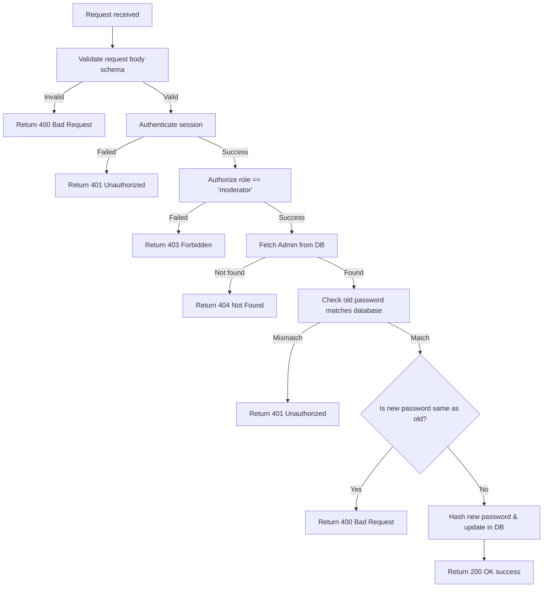

# Update Admin Password

Changes the password for the authenticated administrator/moderator.

---

## Endpoint

```http
PUT /api/v3/admin/update-password
```

---

## Access

| Property       | Value        |
| -------------- | ------------ |
| Route Type     | Private      |
| Authentication | Required     |
| Authorization  | Moderator only |

> **What does this mean?**
> A logged-in administrator/moderator with a valid session can change their password by providing their current (old) password and a valid new password.

---

## Headers

| Header        | Required | Example            | Description                   |
| ------------- | -------- | ------------------ | ----------------------------- |
| Authorization | Yes      | `Bearer <token>`   | Admin's session/refresh token |
| Content-Type  | Yes      | `application/json` | Request body format           |

---

# Request Body

Send the following JSON in the request body.

| Field        | Type   | Required | Description                        | Example       |
| ------------ | ------ | -------- | ---------------------------------- | ------------- |
| old_password | string | Yes      | The current password of the account| `"OldPass@123"` |
| new_password | string | Yes      | The new password to set            | `"NewPass@123"` |

> This endpoint uses **strict validation** — sending any field that is not in the table above will cause the request to fail.

---

# Behavior

1. The new password must satisfy all password strength validation rules.
2. The endpoint checks that the provided `old_password` matches the stored hash in the database.
3. The new password cannot be identical to the old password.
4. On success, the password is encrypted and stored in the database.

---

# How It Works

1. The request body is validated against `updatePasswordSchema` (strict).
2. The user session is authenticated and authorized via the middleware.
3. The server finds the admin record by `userId` (from `req.user.userId`).
4. If not found, a `404 Not Found` error is returned.
5. The server validates that the provided `old_password` matches the admin's database password hash. If not, it throws `401 Unauthorized` (`Invalid old password`).
6. It checks that the `new_password` is not the same as the current password. If it is, it throws `400 Bad Request` (`Same as old password`).
7. The new password is encrypted/hashed using bcrypt.
8. The database is updated with the new password hash.
9. Returns `200 OK` success response.

## Flow Diagram



---

# Validation Rules

| Field        | Rules |
| ------------ | ----- |
| old_password | Required. Must match the existing strength requirements (8–100 characters, at least 1 uppercase, 1 lowercase, 1 number, and 1 special character). |
| new_password | Required. Must match strength requirements (8–100 characters, at least 1 uppercase, 1 lowercase, 1 number, and 1 special character). Must be different from `old_password`. |

---

# Errors

| Status | Cause |
| ------ | ----- |
| 400    | Request body failed schema validation (missing fields, weak password, or `new_password` is identical to `old_password`). |
| 401    | Missing/invalid session token, or the provided `old_password` is incorrect. |
| 403    | The authenticated user does not have the `moderator` role. |
| 404    | Admin account not found in the database. |
| 500    | Unexpected server error or database write failure. |

---

# Response Fields

| Field   | Type    | Description                             |
| ------- | ------- | --------------------------------------- |
| success | boolean | Indicates whether the request succeeded |
| message | string  | Human-readable response message         |

---

# Version History

| Date       | Author   | Description                             |
| ---------- | -------- | --------------------------------------- |
| 2026-06-19 | rushiii3 | Initial documentation for this endpoint |

---

# Quick Summary

| Item            | Value                             |
| --------------- | --------------------------------- |
| Endpoint        | `/api/v3/admin/update-password`   |
| Method          | `PUT`                             |
| Route Type      | Private                           |
| Authentication  | Required                          |
| Content-Type    | `application/json`                |
| Success Status  | `200 OK`                          |
| Rate Limit      | N/A                               |
| Response Format | JSON                              |
