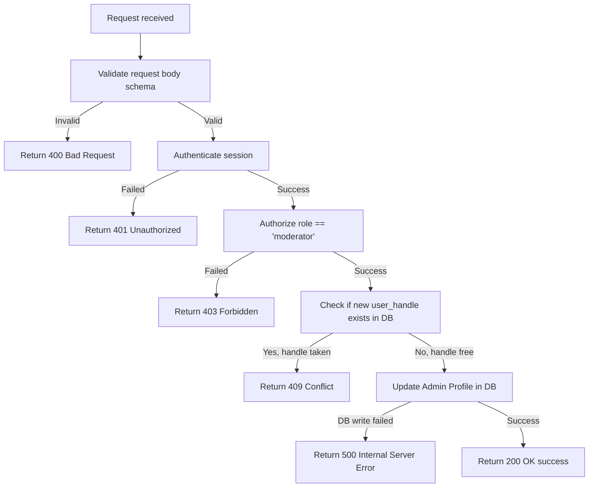

# Update Admin Profile

Updates the profile details (name, handle, and avatar URL) of the authenticated administrator/moderator.

---

## Endpoint

```http
PUT /api/v3/admin/update-profile
```

---

## Access

| Property       | Value        |
| -------------- | ------------ |
| Route Type     | Private      |
| Authentication | Required     |
| Authorization  | Moderator only |

> **What does this mean?**
> Callers must be logged in as an administrator/moderator with a valid session token.

---

## Headers

| Header        | Required | Example            | Description                   |
| ------------- | -------- | ------------------ | ----------------------------- |
| Authorization | Yes      | `Bearer <token>`   | Admin's session/refresh token |
| Content-Type  | Yes      | `application/json` | Request body format           |

---

# Request Body

Send the following JSON in the request body.

| Field         | Type   | Required | Description                     | Example                            |
| ------------- | ------ | -------- | ------------------------------- | ---------------------------------- |
| user_name     | string | Yes      | New display name for the admin  | `"New Display Name"`               |
| user_handle   | string | Yes      | New unique username/handle      | `"new_admin_handle"`               |
| profile_avtar | string | No       | Optional profile avatar image URL | `"https://example.com/avatar.png"` |

> This endpoint uses **strict validation** — sending any field that is not in the table above will cause the request to fail.

---

# Behavior

1. The provided `user_handle` must be unique. If the handle is already registered by another admin, the request returns a `409 Conflict` error.
2. Avatar URL must be a valid URL format if provided.

---

# How It Works

1. The request body is validated against `adminUpdateProfile` schema (strict).
2. The user is authenticated and authorized via the middleware.
3. The server extracts the `userId` (from `req.user.userId`).
4. The server queries the database to check if the requested `user_handle` already exists.
5. If the handle exists (owned by any admin), it throws `409 Conflict` (`User handle already exists`).
6. The server updates the database record with the new `user_name`, `user_handle`, and optional `profile_avtar`.
7. If the update fails, it returns a `500 Internal Server Error`.
8. Returns `200 OK` success response.

## Flow Diagram



---

# Validation Rules

| Field         | Rules |
| ------------- | ----- |
| user_name     | Required. 2–50 characters. Letters and spaces only. |
| user_handle   | Required. 3–20 characters. Letters, numbers, and underscores only. Must be unique. |
| profile_avtar | Optional. Must be a valid URL if provided. |

---

# Errors

| Status | Cause |
| ------ | ----- |
| 400    | Request body failed schema validation (missing fields, invalid handle characters, or malformed URL). |
| 401    | Missing, invalid, or expired session token. |
| 403    | The authenticated user does not have the `moderator` role. |
| 409    | The requested `user_handle` is already taken. |
| 500    | Unexpected server error or database write failure. |

---

# Response Fields

| Field   | Type    | Description                             |
| ------- | ------- | --------------------------------------- |
| success | boolean | Indicates whether the request succeeded |
| message | string  | Human-readable response message         |

---

# Version History

| Date       | Author   | Description                             |
| ---------- | -------- | --------------------------------------- |
| 2026-06-19 | rushiii3 | Initial documentation for this endpoint |

---

# Quick Summary

| Item            | Value                             |
| --------------- | --------------------------------- |
| Endpoint        | `/api/v3/admin/update-profile`    |
| Method          | `PUT`                             |
| Route Type      | Private                           |
| Authentication  | Required                          |
| Content-Type    | `application/json`                |
| Success Status  | `200 OK`                          |
| Rate Limit      | N/A                               |
| Response Format | JSON                              |
